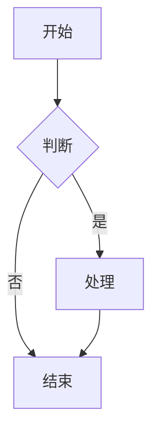
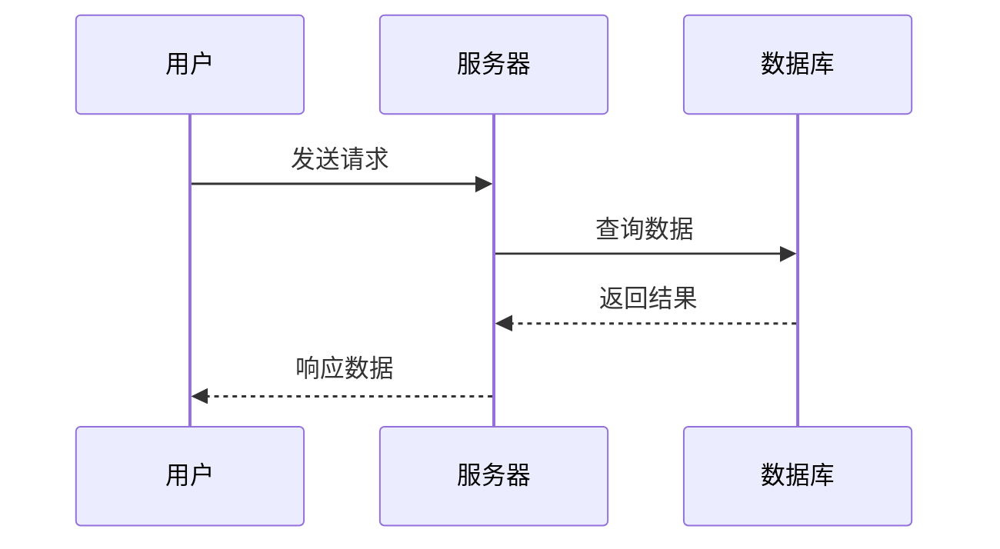
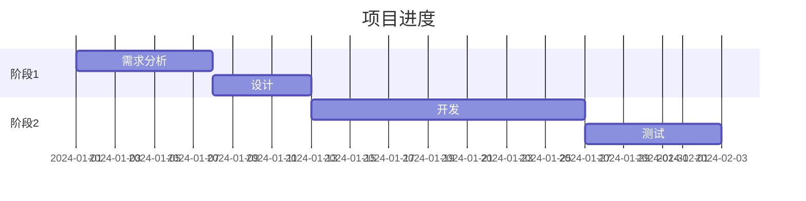

# MarkFlow - Markdown / 图片 / Excalidraw 编辑器

一个简洁优雅的编辑器，提供 Markdown 编辑与预览分离体验，支持 Markdown、纯文本、图片预览和 Excalidraw 绘图，并可直接管理本地文件夹中的全部文件。


## ✨ 功能特性

### 1. 编辑 / 预览分离模式

- **分离体验**：预览态显示渲染结果，点击后进入独立编辑态（纯文本 Markdown 输入）
- **统一输入行为**：标题、段落、列表等都使用同一编辑模式，避免块级编辑差异
- **极简界面**：减少编辑时视觉干扰，聚焦文本输入
- **格式化 Toggle**：选中文本点击格式化按钮可切换添加/移除格式
- **同块实时编辑渲染**：点击编辑时在同一个块内叠加输入层，边输入边看到渲染更新（而非切到独立输入区）

**工作方式**：
1. 默认显示 Markdown 预览
2. 点击内容区域进入编辑模式
3. 编辑完成后失焦返回预览

### 2. Slash (/) 快捷命令

输入 `/` 快速插入各种内容：

| 命令 | 功能 | 插入内容 |
|------|------|---------|
| `/h1` | 标题 1 | `# ` |
| `/h2` | 标题 2 | `## ` |
| `/bullet` | 无序列表 | `- ` |
| `/numbered` | 有序列表 | `1. ` |
| `/todo` | 待办事项 | `- [ ] ` |
| `/code` | 代码块 | 代码块模板 |
| `/math` | 数学公式块 | `$$..$$` |
| `/table` | 表格 | 表格模板 |
| `/mermaid` | Mermaid 图表 | 流程图模板 |
| `/link` | 链接 | `[text](url)` |
| `/image` | 图片 | `` |
| `/wikilink` | Wiki 链接 | `[[` |

**使用方法**：
1. 在空行输入 `/`
2. 弹出命令菜单
3. 使用 ↑↓ 选择，Enter 确认，Esc 关闭
4. 或继续输入过滤命令

**界面说明（极简优化）**：
- 更轻量的弹层与更克制的配色，和编辑器整体风格一致
- 分类标题、命令项、快捷键徽标视觉层级更清晰
- 鼠标与键盘选择状态更一致，减少视觉跳变

### 3. Mermaid 图表支持

支持 Mermaid 语法渲染流程图、时序图、甘特图等：

**流程图示例**：


**时序图示例**：


**甘特图示例**：


### 4. 双向链接 (Bi-directional Links)

类似 Obsidian 的双向引用功能：

**创建链接**：
- 使用 `[[文件名]]` 语法创建链接
- 例如：`[[项目计划]]` 链接到 "项目计划.md"

**反向链接面板**：
- 右侧面板显示当前文件的所有反向链接
- 显示哪些文件引用了当前文件
- 点击链接可快速跳转

**功能特点**：
- 自动检测链接目标是否存在
- 支持跨文件导航
- 显示链接上下文

### 5. Excalidraw 绘图支持

- **新建 Excalidraw 文件**：侧边栏点击"新建" → 选择"Excalidraw"
- **手绘风格绘图**：支持手绘风格的图表、流程图、示意图
- **实时保存**：绘图内容自动保存到 store
- **主题适配**：自动跟随编辑器的亮色/暗色主题
- **导出功能**：支持导出为 PNG、SVG 等格式

**支持的文件格式**：
- `.excalidraw` - Excalidraw 文件
- `.excalidraw.json` - Excalidraw JSON 格式

### 6. 撤销与重做

- **撤销**：`Ctrl/Cmd + Z`
- **重做**：`Ctrl/Cmd + Shift + Z` 或 `Ctrl/Cmd + Y`
- 支持多级撤销历史

### 7. 侧边栏与文件管理

- **打开文件夹**：点击工具栏的"打开文件夹"图标，选择本地文件夹
- **目录树**：左侧侧边栏显示文件夹下的所有文件和子目录（不再只显示 Markdown）
- **文件切换**：点击侧边栏中的文件即可打开；文本文件进入编辑器，图片文件进入预览
- **折叠/展开**：侧边栏支持折叠，最大化写作空间
- **右键菜单**：支持创建、重命名、删除文件和文件夹
- **文件类型图标**：Markdown/纯文本、图片、二进制、Excalidraw 均有不同图标

**支持的文件能力**：
- `markdown` / `text`：可编辑（编辑/预览分离 + 工具栏 + 双向链接）
- `image`：可预览（主区域大图展示）
- `pdf`：可在主区域内嵌预览
- `excalidraw`：可绘图编辑
- `binary`：可在目录中管理，当前提供友好占位提示

### 8. 数学公式 (LaTeX) 支持

支持完整的 LaTeX 数学公式输入，基于 KaTeX 高性能渲染。

**行内公式**：使用 `$` 包裹

```markdown
输入：$E = mc^2$
显示：E = mc²
```

### 8.1 列表编辑

- 列表与其他内容共用同一编辑态（编辑/预览分离）
- 保持标准 Markdown 输入行为，避免列表与段落出现不同交互模型

**块级公式**：使用 `$$` 包裹并换行

```markdown
输入：
$$
\frac{-b \pm \sqrt{b^2 - 4ac}}{2a}
$$
```

### 9. PDF 导出

- 点击工具栏右侧的"打印/导出"图标
- 自动打开打印预览窗口
- 选择"另存为 PDF"即可导出

### 10. 专注模式

- 点击工具栏的专注模式按钮
- 自动隐藏侧边栏和工具栏，提供无干扰的写作环境
- 按 `Esc` 键退出专注模式

### 11. Dark Mode 切换

- 点击工具栏的太阳/月亮图标
- 一键切换亮色/暗色主题
- 自动保存主题偏好到本地存储

### 12. 查找功能

- **跨文件搜索**：搜索所有打开的文件内容
- **快捷键**：`Ctrl+F` 打开搜索面板
- **高亮匹配**：搜索结果高亮显示
- **快速导航**：点击结果直接跳转到对应文件

### 13. 文件保存

- **自动检测**：编辑后文件名旁显示橙色圆点
- **快捷键保存**：`Ctrl+S` 保存当前文件
- **真实保存**：打开文件夹后，文件会保存到实际磁盘
- **离开提醒**：未保存时关闭页面会提示

### 14. 刷新后自动恢复目录（新）

- **自动记住上次打开的文件夹**：首次授权后会持久化目录句柄
- **刷新自动恢复**：刷新页面后会尝试恢复目录结构与当前文件
- **权限安全**：浏览器权限被收回时不会强行恢复，并会提示点击“打开”重新授权

### 15. 多语言支持

- **中英文切换**：点击工具栏的语言图标
- **自动检测**：根据浏览器语言自动设置
- **偏好保存**：语言选择保存到本地存储

## 🚀 快速开始

### 环境要求

- Node.js 18+ 或 Bun
- Chrome、Edge 或其他支持 File System Access API 的浏览器

### 使用 Bun（推荐）

```bash
# 安装依赖
bun install

# 启动开发服务器
bun run dev

# 构建生产版本
bun run build
```

### 使用 npm

```bash
# 安装依赖
npm install

# 启动开发服务器
npm run dev

# 构建生产版本
npm run build
```

## 📖 使用指南

### 基本操作

1. **创建 Markdown 文件**：点击侧边栏的"新建" → 选择"Markdown"
2. **创建 Excalidraw 文件**：点击侧边栏的"新建" → 选择"Excalidraw"
3. **创建新文件夹**：点击侧边栏的"文件夹"按钮
4. **打开本地文件夹**：点击工具栏的文件夹图标
5. **保存文件**：`Ctrl+S` 或点击保存按钮

### Markdown 格式化 Toggle

| 操作 | 结果 |
|------|------|
| 选中 `文字` 点击粗体 | 变成 `**文字**` |
| 选中 `**文字**` 点击粗体 | 变成 `文字`（移除格式） |
| 没有选中文字点击粗体 | 插入 `****`，光标在中间 |

### Markdown 语法支持

| 功能 | 语法 | 工具栏按钮 |
|------|------|--------|
| 粗体 | `**文本**` | **B** |
| 斜体 | `*文本*` | *I* |
| 标题 1-3 | `# 标题` | H |
| 代码 | `` `代码` `` | `</>` |
| 链接 | `[文本](URL)` | 🔗 |
| 图片 | `` | 🖼️ |
| 引用 | `> 引用内容` | " |
| 无序列表 | `- 项目` | • |
| 有序列表 | `1. 项目` | 1. |
| 表格 | 见下方示例 | ⊞ |
| 分割线 | `---` | — |

### 编辑器快捷键

| 快捷键 | 功能 |
|--------|------|
| `Enter` | 创建新块 |
| `Backspace` | 删除空块 |
| `Tab` | 插入缩进 |
| `↑` (光标在行首) | 移动到上一块 |
| `↓` (光标在行尾) | 移动到下一块 |
| `Escape` | 退出编辑模式 / 退出专注模式 |
| `Ctrl/Cmd + S` | 保存文件 |
| `Ctrl/Cmd + F` | 打开搜索 |
| `Ctrl/Cmd + Z` | 撤销 |
| `Ctrl/Cmd + Shift + Z` | 重做 |
| `Ctrl/Cmd + Y` | 重做 |
| `/` (空行) | 打开命令菜单 |

### 表格示例

```markdown
| 功能 | 状态 |
|------|------|
| WYSIWYG | ✅ |
| Excalidraw | ✅ |
| 数学公式 | ✅ |
| PDF 导出 | ✅ |
| Dark Mode | ✅ |
| 查找功能 | ✅ |
| 多语言 | ✅ |
```

### 代码块示例

````markdown
```javascript
function greet(name) {
  console.log(`Hello, ${name}!`);
}
```
````

## 🛠️ 技术栈

- **框架**：Next.js 16 (App Router)
- **语言**：TypeScript 5
- **样式**：Tailwind CSS 4 + shadcn/ui
- **Markdown 渲染**：react-markdown + remark-gfm
- **数学公式**：KaTeX (rehype-katex)
- **代码高亮**：react-syntax-highlighter
- **绘图**：Excalidraw
- **状态管理**：Zustand
- **图标**：Lucide React

## 📁 项目结构

```
src/
├── app/
│   ├── page.tsx          # 主页面
│   ├── layout.tsx        # 布局组件
│   └── globals.css       # 全局样式
├── components/
│   ├── editor/
│   │   ├── TyporaEditor.tsx     # Markdown 编辑器
│   │   ├── ExcalidrawEditor.tsx # Excalidraw 编辑器
│   │   ├── Sidebar.tsx          # 侧边栏组件
│   │   ├── Toolbar.tsx          # 工具栏组件
│   │   └── SearchDialog.tsx     # 搜索对话框
│   └── ui/                      # shadcn/ui 组件
├── store/
│   └── editor-store.ts          # Zustand 状态管理
├── lib/
│   └── i18n.ts                  # 国际化翻译
└── hooks/                       # 自定义 Hooks
```

## 🎨 自定义样式

编辑器支持通过 CSS 变量自定义主题：

```css
:root {
  --background: oklch(1 0 0);
  --foreground: oklch(0.145 0 0);
  --primary: oklch(0.205 0 0);
  /* 更多变量见 globals.css */
}
```

## ⚠️ 浏览器兼容性

| 功能 | Chrome/Edge | Firefox | Safari |
|------|-------------|---------|--------|
| 基本编辑 | ✅ | ✅ | ✅ |
| 数学公式 | ✅ | ✅ | ✅ |
| PDF 导出 | ✅ | ✅ | ✅ |
| Dark Mode | ✅ | ✅ | ✅ |
| 查找功能 | ✅ | ✅ | ✅ |
| Excalidraw | ✅ | ✅ | ✅ |
| 打开文件夹 | ✅ | ❌ | ❌ |
| 保存到磁盘 | ✅ | ❌ | ❌ |

> Firefox 和 Safari 不支持 File System Access API，无法打开本地文件夹。

## 🚀 部署指南

### 方式一：Vercel 部署（推荐）

Vercel 是 Next.js 的官方托管平台，部署最简单：

1. **推送代码到 GitHub**
   ```bash
   git init
   git add .
   git commit -m "Initial commit"
   git remote add origin https://github.com/your-username/your-repo.git
   git push -u origin main
   ```

2. **连接 Vercel**
   - 访问 [vercel.com](https://vercel.com)
   - 使用 GitHub 账号登录
   - 点击 "Import Project"
   - 选择你的仓库
   - 点击 "Deploy"

3. **自动部署**
   - 每次推送到 main 分支会自动部署
   - PR 会生成预览链接

### 方式二：Docker 部署

**使用 Bun（推荐）：**

```dockerfile
FROM oven/bun:1 AS base
WORKDIR /app

FROM base AS deps
COPY package.json bun.lockb ./
RUN bun install --frozen-lockfile

FROM base AS builder
COPY --from=deps /app/node_modules ./node_modules
COPY . .
RUN bun run build

FROM base AS runner
ENV NODE_ENV=production
COPY --from=builder /app/.next/standalone ./
COPY --from=builder /app/.next/static ./.next/static
COPY --from=builder /app/public ./public

EXPOSE 3000
CMD ["bun", "server.js"]
```

**构建并运行：**

```bash
docker build -t markflow .
docker run -p 3000:3000 markflow
```

### 方式三：传统服务器部署

```bash
# 安装依赖
bun install  # 或 npm install

# 构建
bun run build  # 或 npm run build

# 启动
bun run start  # 或 npm run start

# 使用 PM2 管理
pm2 start bun --name "markflow" -- run start
```

## 📝 开发说明

### 代码规范

```bash
# 运行 ESLint 检查
bun run lint  # 或 npm run lint
```

### 数据库操作（如需要）

```bash
bun run db:push
bun run db:generate
```

## 🤝 贡献指南

欢迎提交 Issue 和 Pull Request！

## 📄 许可证

MIT License

---

**享受写作和绘图的乐趣！** ✍️🎨
